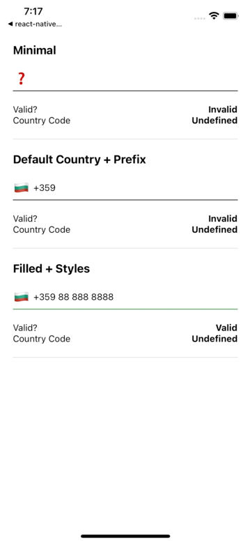
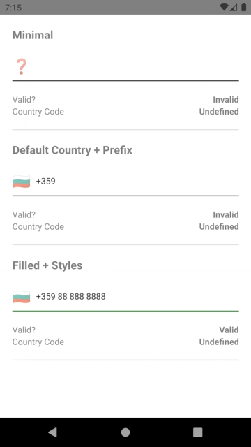

# react-native-intl-phone-field
<a href="https://www.npmjs.com/package/react-native-intl-phone-field">
    
</a>

React Native text input for validating international phone numbers, built on top of [libphonenumber](https://github.com/google/libphonenumber) by Google using [phonenumber-js](https://gitlab.com/catamphetamine/libphonenumber-js).

 

## 👋 Introduction

A simple `<TextInput>` that validates and formats international phone numbers using Google's library [libphonenumber](https://github.com/google/libphonenumber)  and [phonenumber-js](https://gitlab.com/catamphetamine/libphonenumber-js).  Works with pre-propulated data and displays an emoji flag if country code is derived from the number. Additionally, adds a `+` sign infront of the number, so it's considered international.

## ⚙️ Installation

```sh
yarn add react-native-intl-phone-field
```

## ✂️ Usage

```js
import IntlPhoneField from 'react-native-intl-phone-field';

<IntlPhoneField
  onEndEditing={(result) => console.log(result)}
  onValidation={(isValid) => console.log(isValid)}
  defaultCountry="BG"
  defaultPrefix="+359"
  defaultFlag="🇧🇬"
/>
```

For more detailed example, take a look at the demo app inside [example/](./example).

## ⚪ Props

| Property          | Type       | Default   | Description                                                                                                                                                            |
|-------------------|------------|-----------|------------------------------------------------------------------------------------------------------------------------------------------------------------------------|
| flagUndetermined  | string?    | `❓`       | Displayed when country code cannot be derived from current phone number.                                                                                               |
| onEndEditing  | `function` | undefined | Callback that is called when text input ends [ text input ends](https://reactnative.dev/docs/textinput#onendediting).<br/> It receives [`result`](.src/index.ts#L124). |
| onValidation          | `function` | undefined | Callback that is called each time the validation status changes.                                                                                                       |
| defaultCountry          | `string`   | undefined | Two letter code for default country, eg. `BG`                                                                                                                          |
| defaultPrefix          | `string`   | undefined | Default number prefix, eg. `+359`                                                                                                                                      |
| defaultValue          | `string`   | undefined | Default value for the `TextInput`, if you want to pre-populate it.                                                                                                     |
| defaultFlag          | `string`   | undefined | Emoji for the default flag, eg. `🇧🇬`                                                                                                                                 |
| containerStyle          | `object`   | undefined | Styles for the component's wrapper `<View />`                                                                                                                          |
| flagContainerStyle          | `object`   | undefined | Styles for the flag emoji wrapper `<View />`                                                                                                                           |
| flagTextStyle          | `object`   | undefined | Styles for the flag emoji `<Text />`                                                                                                                                   |
| textInputStyle          | `object`   | undefined | Styles for the underlying `<TextInput />`                                                                                                                              |
| textInputProps          | `object`   | undefined | [Additional props](https://reactnative.dev/docs/textinput#props) for the underlying `<TextInput />`                                                                    |

## Contributing

See the [contributing guide](CONTRIBUTING.md) to learn how to contribute to the repository and the development workflow.

## License

MIT
